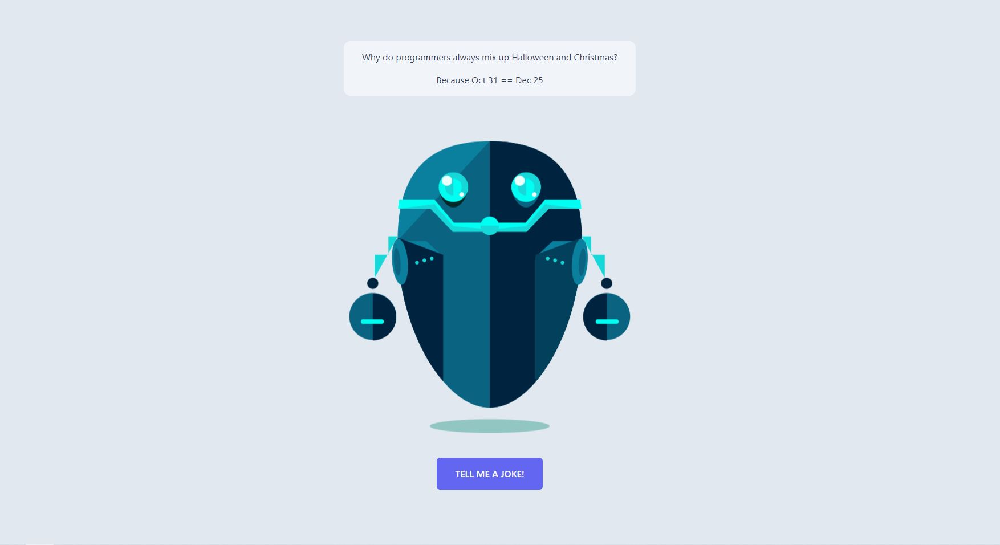
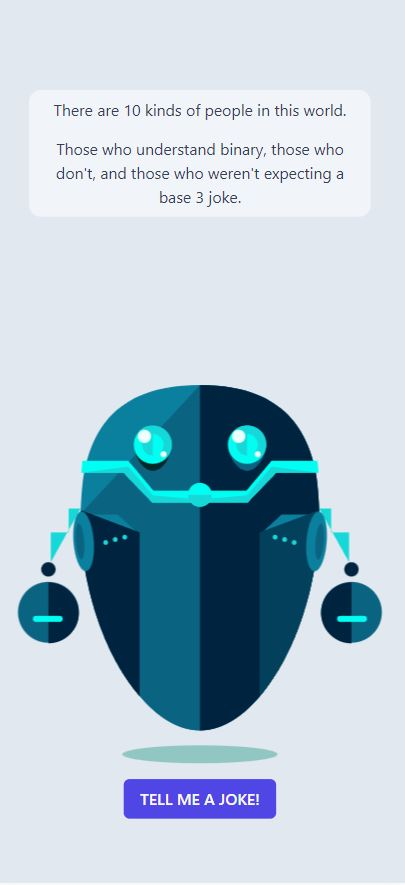

<h1>Joke Telling Bot</h1>

An application in which a robot tells programming jokes

In the application, every time the user presses a button, a query is sent to the API, and then the response is handled, the response from the API is of course a joke

<h2>Tech. Stack</h2>
<ul>
    <li>HTML</li>
    <li>Tailwind</li>
    <li>Vue 3</li>
    <li>TypeScript</li>
    <li>API (link: https://official-joke-api.appspot.com/jokes/programming/random)</li>
</ul>

<h2>Preview</h2>

